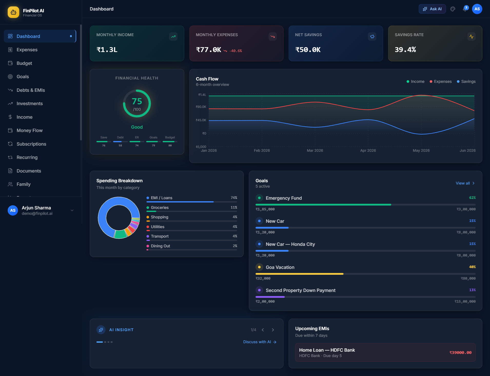
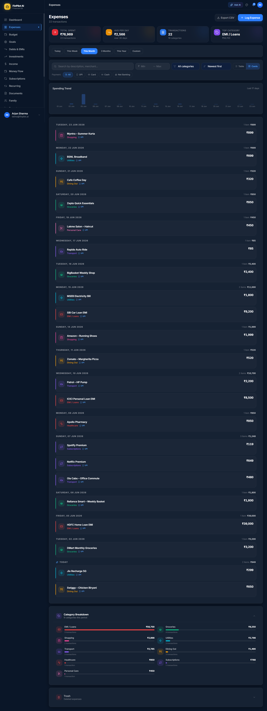
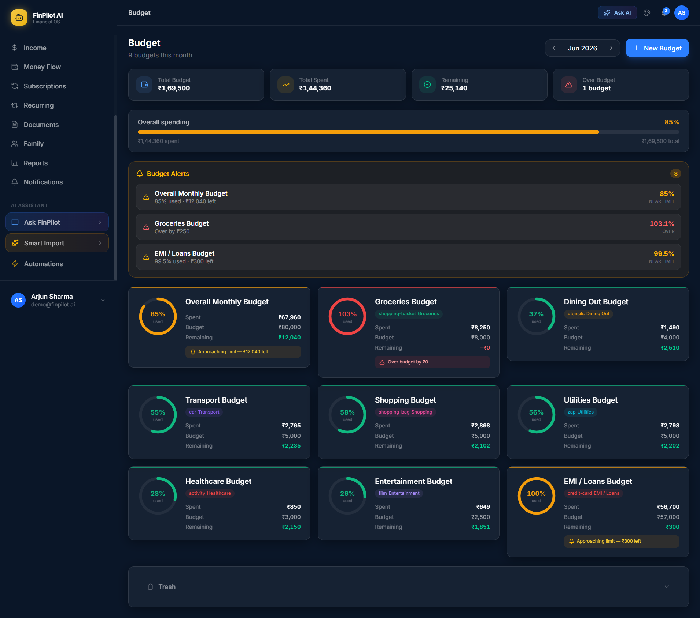
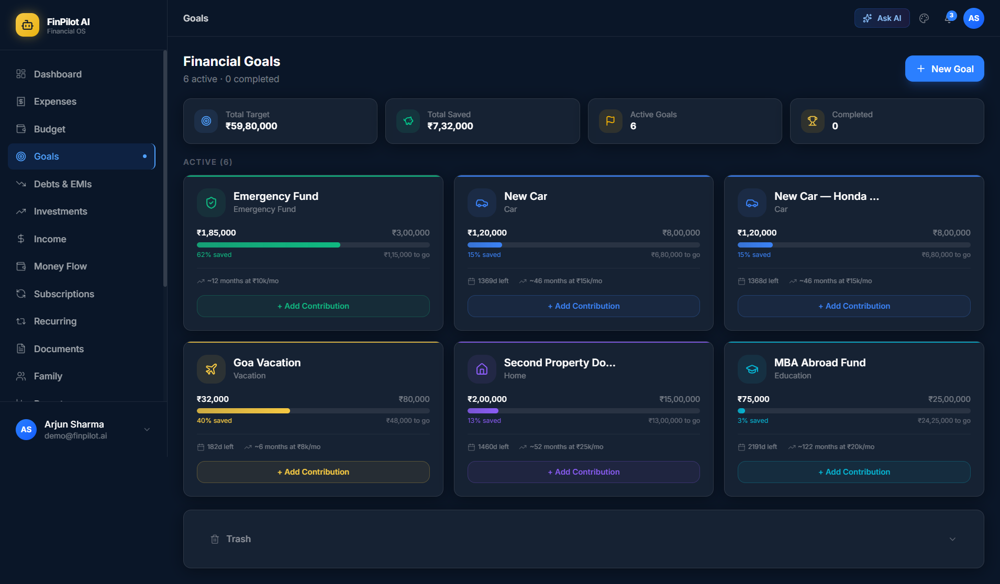
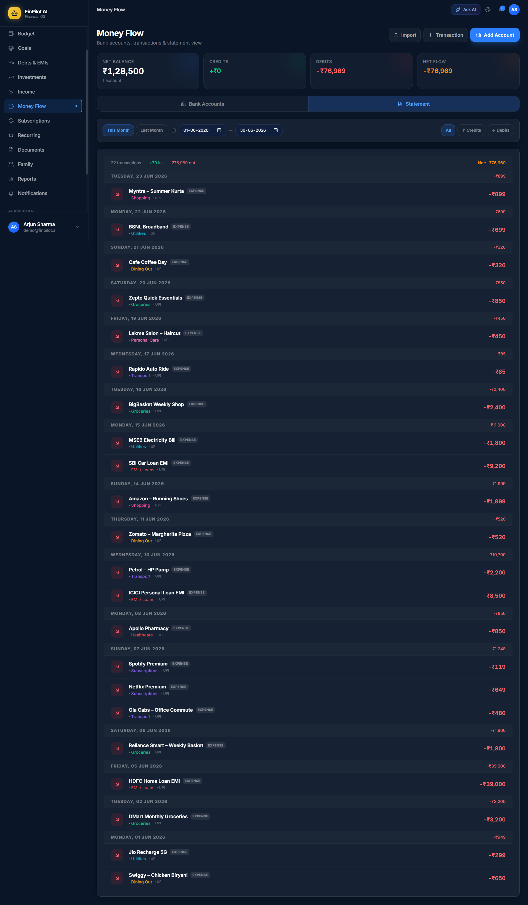
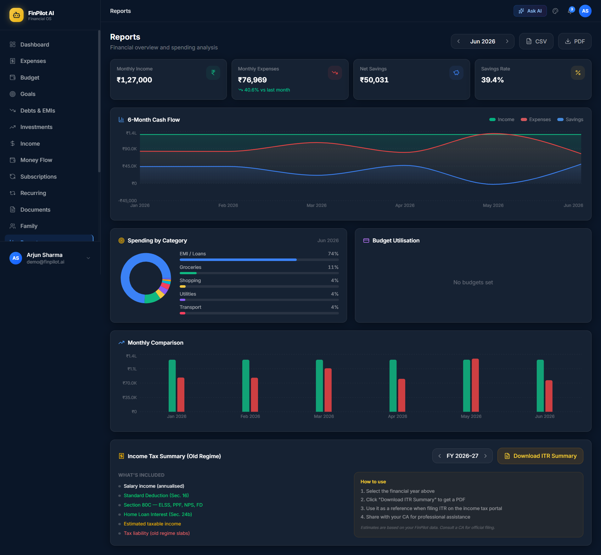
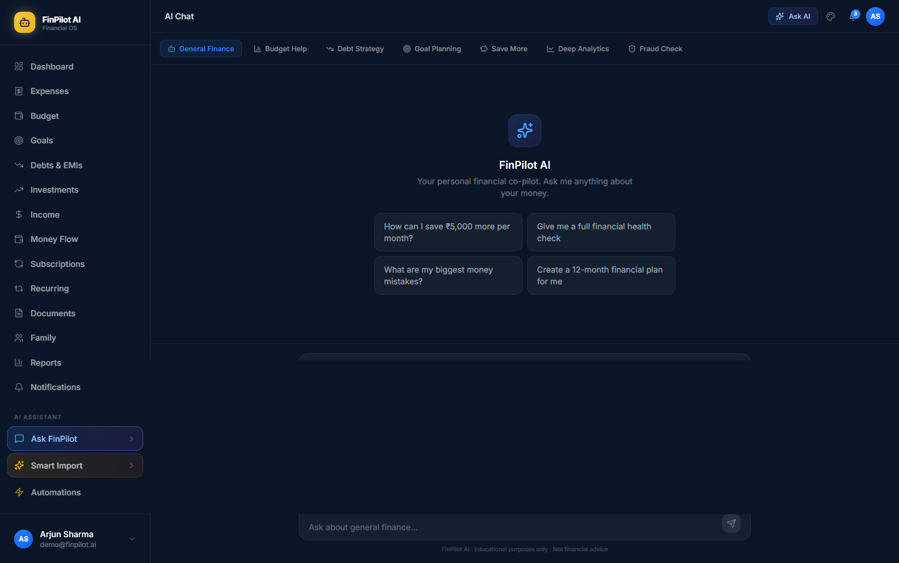
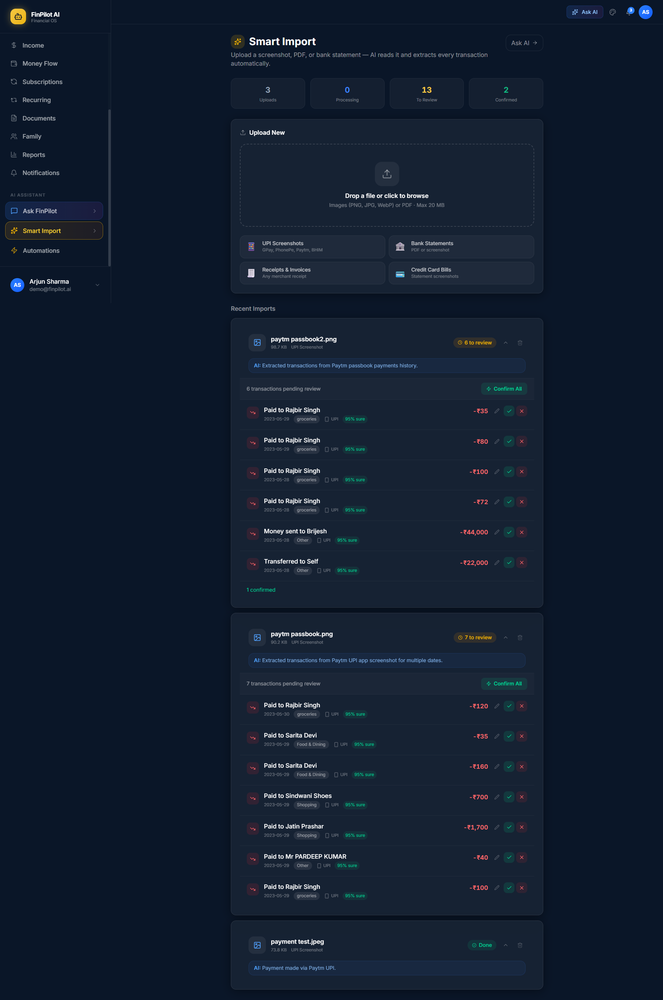
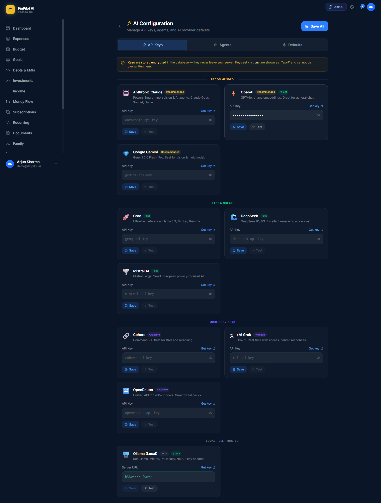

<div align="center">


# FinPilot AI

### Your personal finance co-pilot — powered by AI

[](https://laravel.com)
[](https://react.dev)
[](https://www.typescriptlang.org)
[](https://tailwindcss.com)
[](LICENSE)
[](https://github.com/lalitaryan1993/FinPilot-AI/stargazers)

<br/>

**FinPilot AI** is a full-stack, open-source personal finance operating system.  
Track every rupee, automate categorisation, import bank statements with AI, and get insights — all in a beautiful dark-themed dashboard.

<br/>

[**Live Demo**](https://github.com/lalitaryan1993/FinPilot-AI) · [**Report a Bug**](https://github.com/lalitaryan1993/FinPilot-AI/issues) · [**Request a Feature**](https://github.com/lalitaryan1993/FinPilot-AI/issues)

</div>

---

## Why FinPilot AI?

Most finance apps are either too simple or locked behind a subscription. FinPilot AI is:

- **Self-hosted** — your financial data stays on your server
- **AI-powered** — import receipts, statements, and SMS with one click
- **Multi-provider** — works with Anthropic Claude, OpenAI, or Google Gemini
- **Complete** — expenses, budgets, investments, bank accounts, goals, debts, family sharing, and more
- **Beautiful** — dark-themed glassmorphism UI with smooth animations

---

## Screenshots

<table>
  <tr>
    <td align="center"><b>Dashboard</b></td>
    <td align="center"><b>Expenses</b></td>
  </tr>
  <tr>
    <td></td>
    <td></td>
  </tr>
  <tr>
    <td align="center"><b>Budget</b></td>
    <td align="center"><b>Goals</b></td>
  </tr>
  <tr>
    <td></td>
    <td></td>
  </tr>
  <tr>
    <td align="center"><b>Money Flow</b></td>
    <td align="center"><b>Reports</b></td>
  </tr>
  <tr>
    <td></td>
    <td></td>
  </tr>
  <tr>
    <td align="center"><b>AI Chat</b></td>
    <td align="center"><b>Smart Import</b></td>
  </tr>
  <tr>
    <td></td>
    <td></td>
  </tr>
  <tr>
    <td align="center"><b>AI Configuration</b></td>
    <td align="center"></td>
  </tr>
  <tr>
    <td></td>
    <td></td>
  </tr>
</table>

---

## Feature Overview

### 💸 Expense Management
- Card and table views with animated transitions
- Category icons rendered from DB slugs
- Filter by date range, category, payment method, amount range
- Spending trend chart (Recharts bar chart)
- Category breakdown with color-coded rings
- Bulk delete with undo
- Soft delete / trash & restore

### 💰 Income Sources
- Track salary, freelance, rental, dividends, and more
- Income mix donut chart
- Pause / resume income sources
- Frequency-aware monthly equivalent calculation

### 📊 Budget Tracking
- Radial progress rings per budget
- Real-time over-budget alert banner
- Monthly / weekly / quarterly / custom periods
- Rollover support
- Alert threshold per budget (e.g. alert at 80%)

### 🎯 Goals & Savings
- Set savings targets with deadlines
- Log contributions manually
- Visual progress bar and projected completion date

### 🏦 Money Flow (Bank Accounts)
- Add savings, current, credit card, wallet, and FD accounts
- Manual credit / debit transaction entry
- **AI bank statement import** — upload image, PDF, or paste SMS text
- Edit / delete transactions with automatic balance correction
- Combined statement view: bank transactions + expenses in one unified timeline
- Filter by credit / debit / all, date range presets

### 📈 Investments
- Track mutual funds, stocks, FD, RD, PPF, EPF, NPS, gold, real estate, crypto, bonds
- **XIRR calculator** — computes annualised return per investment using Newton-Raphson, handles SIP monthly cash flows automatically
- Portfolio allocation donut chart
- SIP tracking with monthly amount and debit day

### 💳 Subscriptions & Recurring
- Track subscriptions by billing cycle
- Auto-detect recurring expense patterns

### 🤖 AI Features
| Feature | What it does |
|---|---|
| **Smart Import** | Upload UPI screenshots, bank PDFs, salary slips — AI extracts all transactions for review |
| **Bank SMS Import** | Paste bank SMS messages — AI parses credits and debits |
| **AI Chat** | Ask FinPilot anything about your finances |
| **Automation Rules** | Auto-categorise transactions by merchant or description |
| **Multi-provider** | Anthropic Claude, OpenAI GPT-4o, Google Gemini — switch anytime |

### 👨‍👩‍👧 Other Modules
- **Family** — shared expenses, invite members with a code
- **Debts & EMIs** — EMI calendar, payment history, debt-free date
- **Documents** — upload and organise financial documents
- **Reports** — CSV export, PDF tax summary
- **Health Score** — composite financial wellness score
- **Notifications** — in-app alerts for budget breaches, large transactions, goal milestones

---

## Tech Stack

| | Technology |
|---|---|
| **Backend** | PHP 8.3, Laravel 13 |
| **Frontend** | React 19, TypeScript, Inertia.js v3 |
| **Styling** | Tailwind CSS v4, Framer Motion |
| **Data fetching** | TanStack Query v5 |
| **Charts** | Recharts |
| **Auth** | Laravel Sanctum |
| **Database** | SQLite (dev) · MySQL 8 (production) |
| **Cache / Queue** | Database (dev) · Redis (production) |
| **AI** | Anthropic Claude · OpenAI · Google Gemini |
| **Build** | Vite 8 |

---

## Getting Started

### Prerequisites

- PHP 8.3+
- Composer 2
- Node.js 20+ & npm
- SQLite **or** MySQL 8
- One AI API key (Anthropic, OpenAI, or Gemini) — optional at setup, users can add their own in Settings

---

### Option A — Local Setup (SQLite + artisan serve)

```bash
# 1. Clone
git clone https://github.com/lalitaryan1993/FinPilot-AI.git
cd FinPilot-AI

# 2. Install dependencies
composer install
npm install

# 3. Environment
cp .env.example .env
php artisan key:generate
```

Edit `.env` — the only required change:

```env
APP_URL=http://localhost:8000

# Add at least one AI key (optional — users can add their own in Settings)
ANTHROPIC_API_KEY=sk-ant-...
OPENAI_API_KEY=sk-...
GEMINI_API_KEY=AI...
```

```bash
# 4. Database
touch database/database.sqlite
php artisan migrate --seed

# 5. Build frontend
npm run build

# 6. Start
php artisan serve
```

Open **http://localhost:8000** → Register → you're in.

---

### Option B — Docker (MySQL + Redis + Queue worker)

```bash
# 1. Clone & configure
git clone https://github.com/lalitaryan1993/FinPilot-AI.git
cd FinPilot-AI
cp .env.example .env
```

Set these in `.env`:

```env
DB_CONNECTION=mysql
DB_HOST=mysql
DB_DATABASE=finpilot
DB_USERNAME=finpilot
DB_PASSWORD=secret

REDIS_HOST=redis
CACHE_STORE=redis
SESSION_DRIVER=redis
QUEUE_CONNECTION=redis

ANTHROPIC_API_KEY=sk-ant-...
```

```bash
# 2. Build & start
docker compose up -d --build

# 3. Initialise
docker compose exec app php artisan key:generate
docker compose exec app php artisan migrate --seed
```

Open **http://localhost:8000**

---

## Environment Variables

| Variable | Description | Default |
|---|---|---|
| `APP_KEY` | Encryption key — run `php artisan key:generate` | — |
| `APP_URL` | Your app's public URL | `http://localhost` |
| `DB_CONNECTION` | `sqlite` or `mysql` | `sqlite` |
| `DB_HOST` | MySQL host (Docker: `mysql`) | `127.0.0.1` |
| `DB_DATABASE` | Database name | `laravel` |
| `DB_USERNAME` | Database user | `root` |
| `DB_PASSWORD` | Database password | — |
| `ANTHROPIC_API_KEY` | Anthropic Claude API key | — |
| `OPENAI_API_KEY` | OpenAI API key | — |
| `GEMINI_API_KEY` | Google Gemini API key | — |
| `CACHE_STORE` | `database` or `redis` | `database` |
| `SESSION_DRIVER` | `database` or `redis` | `database` |
| `QUEUE_CONNECTION` | `database` or `redis` | `database` |

> **Tip:** AI keys are optional at the server level. Every user can configure their own provider keys in **Settings → AI Configuration** inside the app.

---

## AI Provider Comparison

| Provider | Models | Best for |
|---|---|---|
| **Anthropic Claude** ⭐ | claude-opus-4-8, claude-sonnet-4-6 | PDF statements, Smart Import, Chat — recommended |
| **OpenAI** | gpt-4o, gpt-4o-mini | Image import, Chat |
| **Google Gemini** | gemini-1.5-flash | Image import, Chat |

### Smart Import — supported document types
- UPI screenshots (GPay, PhonePe, Paytm, BHIM)
- Bank statement PDFs — sent natively to Claude (no text stripping)
- Bank statement photos / screenshots
- Credit card statements
- Salary slips and receipts
- Pasted bank SMS messages

---

## Project Structure

```
FinPilot-AI/
├── app/
│   ├── Http/Controllers/Api/V1/   # REST API — one controller per module
│   ├── Jobs/ProcessSmartImportJob # AI extraction pipeline
│   ├── Models/                    # Eloquent — all with SoftDeletes
│   └── Ai/                        # Agents & tools for AI chat
├── database/migrations/           # 35+ migrations
├── resources/js/
│   ├── components/
│   │   ├── layout/                # AppLayout, Sidebar, TopBar
│   │   └── ui/                    # GlassCard, DeleteConfirmModal …
│   └── pages/
│       ├── Dashboard/
│       ├── Expenses/              # Index · Create · Edit · Detail
│       ├── Budget/
│       ├── Investments/           # Portfolio + XIRR calculator
│       ├── MoneyFlow/             # Bank accounts + unified statement
│       ├── AI/                    # Chat + Smart Import
│       └── Settings/              # Profile + AI Configuration
└── routes/
    ├── api.php                    # All /api/v1/* routes
    └── web.php                    # Inertia page routes
```

---

## API Overview

All endpoints live under `/api/v1` and require Sanctum authentication.

```
# Auth
POST   /api/v1/auth/register
POST   /api/v1/auth/login
POST   /api/v1/auth/logout

# Core modules (all support soft delete / restore)
GET    /api/v1/expenses            # ?date_from &date_to &category &payment_method &amount_min &amount_max &sort_by &sort_dir
POST   /api/v1/expenses
PUT    /api/v1/expenses/{id}
DELETE /api/v1/expenses/{id}

GET    /api/v1/budgets
GET    /api/v1/investments/portfolio
GET    /api/v1/health-score

# Bank accounts & money flow
GET    /api/v1/bank-accounts
POST   /api/v1/bank-accounts
PUT    /api/v1/bank-accounts/{id}
DELETE /api/v1/bank-accounts/{id}
POST   /api/v1/bank-accounts/{id}/transactions
POST   /api/v1/bank-accounts/import-statement     # multipart: account_id + file or text
GET    /api/v1/money-flow                         # unified timeline (bank + expenses)
GET    /api/v1/bank-transactions/{id}
PUT    /api/v1/bank-transactions/{id}
DELETE /api/v1/bank-transactions/{id}

# AI
POST   /api/v1/smart-imports                      # AI Smart Import (file upload)
POST   /api/v1/ai/chat
```

---

## Useful Commands

```bash
# Reset database with fresh seed data
php artisan migrate:fresh --seed

# List all API routes
php artisan route:list --path="api/v1"

# Clear all caches after config changes
php artisan optimize:clear

# Run tests
php artisan test

# TypeScript check
npx tsc --noEmit

# Hot-reload dev server (run alongside artisan serve)
npm run dev
```

---

## Roadmap

- [ ] Recurring expense auto-categorisation
- [ ] Public demo mode with read-only seeded data
- [ ] Budget alerts via Web Push (VAPID)
- [ ] Mobile app (Capacitor / React Native)
- [ ] Multi-currency with live exchange rates
- [ ] Indian ITR tax report generation
- [ ] Plaid / Finbox bank feed integration

---

## Contributing

Contributions are welcome! Here's how:

1. Fork the repository
2. Create your feature branch: `git checkout -b feature/amazing-feature`
3. Commit: `git commit -m "feat: add amazing feature"`
4. Push: `git push origin feature/amazing-feature`
5. Open a Pull Request

Please keep PRs focused — one feature or fix per PR. For major changes, open an issue first to discuss the approach.

---

## Author

**Lalit Aryan**

[](https://github.com/lalitaryan1993)
[](mailto:lalitaryan1993@gmail.com)

---

## License

Distributed under the **MIT License** — see [LICENSE](LICENSE) for details.

---

## Acknowledgements

<div align="center">

Built with open-source technologies ❤️

[Laravel](https://laravel.com) · [Inertia.js](https://inertiajs.com) · [React](https://react.dev) · [Tailwind CSS](https://tailwindcss.com) · [Framer Motion](https://www.framer.com/motion/) · [Recharts](https://recharts.org) · [TanStack Query](https://tanstack.com/query) · [Lucide Icons](https://lucide.dev) · [Anthropic Claude](https://anthropic.com)

<br/>

⭐ **Star this repo if you find it useful!** It helps others discover it.

</div>
